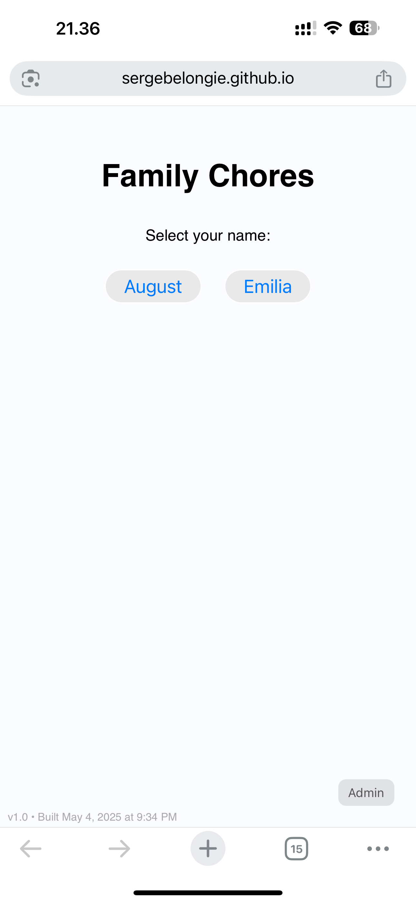
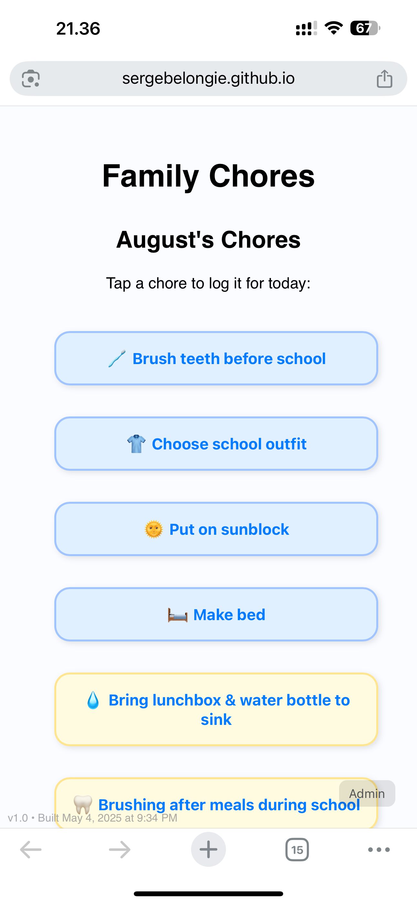
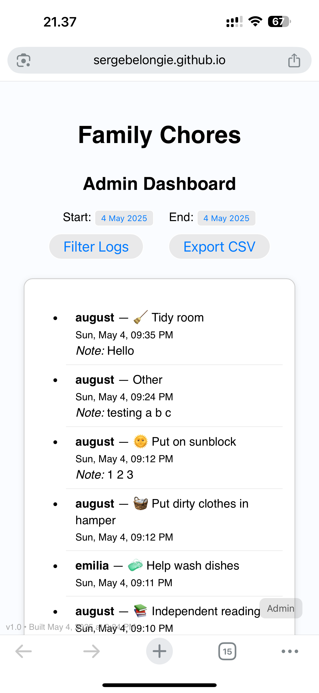

# family-chores

# 🏡 Family Chores Tracker 
*A simple web app to help kids log their household contributions*

---

## Features

- 🔐 PIN login for each child
- 🎨 Emoji-based chore buttons with pastel colors
- 📝 Optional note input when logging a chore
- ✅ Toast-style chore confirmation
- 📅 Weekly chore logs (resets each Monday)
- 🧑‍💼 Admin dashboard
- 📊 Filter logs by date and export to CSV
- 📲 Mobile-optimized layout and app icon
- 🏠 Supports iOS home screen shortcuts

---

## 👀 Screenshots

| Login | Chore Selection | Admin Dashboard |
|-------|------------------|-----------------|
|  |  |  |

---

## 🚀 How It Works

1. **Kids tap their name** on the login screen
2. **Enter 4-digit PIN** via friendly keypad
3. **Tap a chore** → confirm + optional note
4. 🎉 Chore is logged with timestamp
5. Admin can:
   - View all logs
   - Filter by date
   - Export logs as CSV

---

## 🔧 Setup (for developers or curious parents)

1. Fork or clone this repo
2. Set up a Firebase project
3. Create a `users` collection in Firestore with `pin` and `displayName`
4. Add your chore list to `chores.js`
5. Deploy using GitHub Pages or Firebase Hosting

---

## 💡 Tips for Use

- Add the web app to your kid’s iOS home screen for easy access
- Let kids help pick the emoji for each chore 🐹🧦🧽
- Use the logs for weekly rewards, screen time, or allowance
- Admin dashboard supports CSV download and filtering

---

## 📎 License

MIT — use freely and modify as you wish!